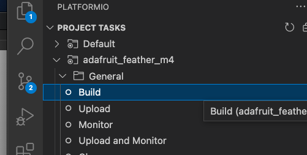
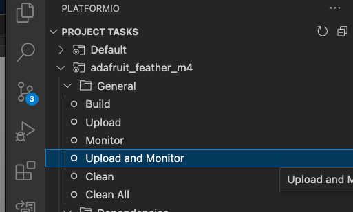

## Programming Quickstart

### Pre-reqs

* Install Arduino IDE 2.x https://www.arduino.cc/en/software (this will install drivers required for the board)
* Install the Platform IO extension in vscode https://platformio.org/install/ide?install=vscode
  ** When Platform IO is first installed, it will show a downloading icon on top of the platform IO extension icon; this means it's downloading board data and first-time files - it will be unavailable for 3-4 minutes

### Build

* Clone this repo
* Connect the m4 board to your laptop via the micro USB connector (make sure it's a port that has power and not a unpowered hub)
* Use the platform IO extension (the alien icon on the left) to access the build menu.  The build *should* automatically get all dependencies; if not there may be some aspect of setup that I'm missing in these steps (this step is just for testing your build environment, in the future you can run upload & monitor alone as it performs a build first):

* On an M1 mac, you must reset the board **before each upload**:
  ** do a "slow double press" of the reset button on the top board (the top board is the wifi board, but the reset button is connected to the reset of the m4 board underneath); if the reset works the red light should be on and a volume named "featherboot" should appear on your desktop
* Upload and monitor - this does build + it will flash the device and open the serial port for monitoring serial print statements:

* if the flash starts but freezes part way through, repeat the reset process and flash again

